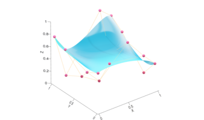
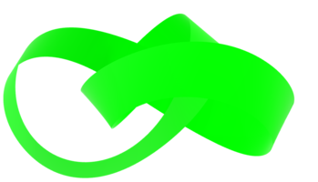
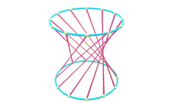

GLTF is a MATLAB class to export 3D graphs and other content into the GL Transmission Format (glTF).

Last updated: December 8, 2022.

> © Copyright 2014-2023 Rohan Chabukswar
>
> This file is part of MATLAB GLTF.
>
> MATLAB GLTF is free software: you can redistribute it and/or modify it under the terms of the GNU General Public License as published by the Free Software Foundation, either version 3 of the License, or (at your option) any later version.
>
> MATLAB GLTF is distributed in the hope that it will be useful, but WITHOUT ANY WARRANTY; without even the implied warranty of MERCHANTABILITY or FITNESS FOR A PARTICULAR PURPOSE. See the GNU General Public License for more details.
>
> You should have received a copy of the GNU General Public License along with MATLAB GLTF. If not, see <https://www.gnu.org/licenses/>.

# Table Of Contents
* [Introduction](#introduction)
    * [Motivation](#motivation)
        * [Frequently Mentioned Oppositions](#frequently-mentioned-oppositions)
        * [Creation Tools](#creation-tools)
        * [Display Tools](#display-tools)
    * [Origin](#origin)
    * [The Name](#the-name)
    * [Beyond MATLAB](#beyond-matlab)
        * [Python](#python)
        * [COMSOL Multiphysics](#comsol-multiphysics)
* [Getting Started](#getting-started)
    * [Setup](#setup)
    * [Basics of 3D Models](#basics-of-3d-models)
    * [Coordinate System and Units](#coordinate-system-and-units)
    * [FV to 3D Model](#fv-to-3d-model)
    * [More depth](#more-depth)
* [Adding Texture](#adding-texture)
* [Extra Features](#extra-features)
* [MATLAB Graph Examples](#matlab-graph-examples)
    * [`plot3`](#plot3)
    * [`surf`](#surf)
    * [`mesh`](#mesh)
    * [`bar3`](#bar3)
* [Animation Example](#animation-example)
    * [Step-By-Step](#step-by-step)
    * [Step-by-Step for Skeletal Animation](#step-by-step-for-skeletal-animation)
* [Helper Functions](#helper-functions)
    * [`addAxes`](#addAxes)
    * [`sphere3d`](#sphere3d)
    * [`polytope`](#polytope)
    * [`bezier`](#bezier)
    * [`bezierT`](#bezierT)
    * [`bezierSurface`](#bezierSurface)
    * [`TNB`](#tnb)
    * [`tubeplot`](#tubeplot)
    * [`removeTorsion`](#removeTorsion)
* [Appendix](#appendix)
    * [Some Common Terminology](#some-common-terminology)

# Introduction
GLTF is a MATLAB class to export 3D graphs and other content into the GL Transmission Format (glTF).

glTF is an efficient, extensible, interoperable, API-neutral runtime asset delivery format for the transmission and loading of 3D content. It is a last-mile format to be passed directly to any rendering engine ([OpenGL](https://www.opengl.org/), [Microsoft Direct3D](https://docs.microsoft.com/en-us/windows/win32/direct3d), [Apple Metal](https://developer.apple.com/metal/), [WebGL](https://www.khronos.org/webgl/), [Vulkan](https://www.vulkan.org/), etc.). It is not meant to simulate physics, or reactive animations, or playing a video game. For example, if you create a lens using `KHR_materials_ior` and `KHR_materials_volume`, do not expect any renderer to display the correct (or even reasonably correct) optics. It is the 3D equivalent of JPEG, PNG, or GIF.

## Motivation
### Frequently Mentioned Oppositions
* **It's unnecessary, and it's not our job.** The information content is the same as the output of the algorithm using graphs and tables, only stupid people need extra visualisations to understand them. Neither we nor our customers are stupid, thank you very much. Our job is to research the algorithms themselves, not sell them to customers. All we need to do is provide the MATLAB or Python code. This is a frivolous endeavour.
    * You get __two__ new dimensions to play with – Z and time.
    * Our products are real world, even if our algorithms aren't, and should be seen working in the real world.
    * Sometimes we work in three dimensions, it is more intuitive to visualise the output and intermediate steps in 3D.
* **It's too much work.** It requires people specialised in 3D modelling and animations, and the associated software to make something visually engaging. We simply don't have the resources to employ new people and buy software for something that has limited use in one single project.
    * **But, is it really?**

### Creation Tools
MATLAB already has functions to display data in 3D:
* [`plot3`](https://www.mathworks.com/help/matlab/ref/plot3.html)
* [`surf`](https://www.mathworks.com/help/matlab/ref/surf.html)
* [`mesh`](https://www.mathworks.com/help/matlab/ref/mesh.html)
* [`hist3`](https://www.mathworks.com/help/stats/hist3.html)
* [`histogram2`](https://www.mathworks.com/help/matlab/ref/matlab.graphics.chart.primitive.histogram2.html)
* [`scatter3`](https://www.mathworks.com/help/matlab/ref/scatter3.html)
* [`stem3`](https://www.mathworks.com/help/matlab/ref/stem3.html)
* [`contour3`](https://www.mathworks.com/help/matlab/ref/contour3.html)
* [`quiver3`](https://www.mathworks.com/help/matlab/ref/quiver3.html)
* [`pie3`](https://www.mathworks.com/help/matlab/ref/pie3.html)
* [`bar3`](https://www.mathworks.com/help/matlab/ref/bar3.html)
* [`bar3h`](https://www.mathworks.com/help/matlab/ref/bar3h.html)

### Display Tools
* [Visual Studio Code](https://code.visualstudio.com/) has an extension that can display GLTF/GLB files using JS libraries.
* [Office 365](https://www.microsoft.com/en-us/garage/wall-of-fame/3d-models-in-office/) has inbuilt 3D models, even animated ones you can use. It also allow you to import external models in FBX, GLTF/GLB, OBJ, STL, etc. formats.
* A number of JS libraries exist to display 3D files, such as [BabylonJS](https://www.babylonjs.com/), [Cesium](https://cesium.com/platform/cesiumjs/), [ThreeJS](https://threejs.org/), [Google Filament](https://github.com/google/filament).
* Apple provides [a Reality Converter app and Python-based command-line tools](https://developer.apple.com/augmented-reality/tools/) to export FBX and GLTF/GLB objects to USDZ, which is used by Android and Apple to show objects in AR.

## Origin
**GLTF class is not available in MATLAB or on MATLAB Central.**

There are no toolboxes or libraries to export 3D object from MATLAB. There are a couple of scripts on MATLAB Central that can help you read and `.stl` and `.obj` files.

Using Blender or MeshLab to create the models or graphics would lose the mathematical aspect, and it would take too long.

Over the last few years, one project required 3D objects and using OpenGL concepts, and some projects used 3D visualisations. The scripts were collected to make this 4000-line class (~850 are documentation).

**Caveat emptor. Get help by typing `help GLTF`, or `help GLTF.method` (where `method` is a GLTF class method) or `help function` (where `function` is one of the helper functions included with the class).**

## The Name
GLTF is an open-source file format a royalty-free specification for the efficient transmission and loading of 3D scenes and models by applications and uses the JSON standard. It is maintained and developed by the Khronos group, which also maintains OpenGL (OpenGL® is the most widely adopted 2D and 3D graphics API in the industry) and used to maintain the predecessor of GLTF (COLLADA). There is huge industry support for GLTF, including import-export, creation, and display.

The class was written mainly to output a GLTF file, so it's called that.

## Beyond MATLAB
### Python
Python support for GLTF exists, but it is unclear how good it is.

[Trimesh](https://github.com/mikedh/trimesh), [PyGLTFLib](https://gitlab.com/dodgyville/pygltflib), and [GLTFLib](https://github.com/sergkr/gltflib) are three relevant Python libraries. PyGLTFLib seems to be the most promising. There seem to be significant shortcomings in Trimesh (such as animations, lights, cameras).  GLTFLib is a fork from an older version of PyGLTFLib, so the implementations have diverged.

Data can always be imported into MATLAB to write GLTF files.

### COMSOL Multiphysics
The [COMSOL Multiphysics](https://www.comsol.com/blogs/how-to-export-and-share-your-3d-result-plots-as-gltf-files/) software has support for exporting results in many different formats. As of version 5.4, you can export results as glTF files.

# Getting Started
**When in doubt, refer to [GLTF Specifications](https://github.com/KhronosGroup/glTF/blob/main/specification/2.0/Specification.adoc).**

Many times, to understand some implementation details, you might be further redirected to [OpenGL Specifications](https://www.khronos.org/opengl/wiki/). If you cannot find something in the GLTF Specifications and you aren't redirected to the OpenGL ones, try looking directly in the OpenGL specs. If nothing else helps, [StackOverflow](https://stackoverflow.com/questions/tagged/gltf) should have something.

## Setup
There is no need for any setup, however, to be able to access the class and helper functions from any folder, it needs to be added to the MATLAB search path. For this, do **ONE** of the following:
* Run `setup.m` provided in the repository, **OR**
* Copy the `addpath` line from `setup.m` to your `startup.m` file, more details [here](https://www.mathworks.com/help/matlab/ref/startup.html), **OR**,
* On the toolstrip in MATLAB, use `Set Path` to select the repository directory (and at least the `functions` subdirectory) and save it permanently to the path.

## Basics of 3D Models
Base 3D models are stored as a list of vertices, where sets of three make a triangle. Vertices can be reused between triangles. All that is needed is this N×3 array of vertices (V), and M×3 array of faces (F).

For example, for a tetrahedron:
* Vertices:
    1. `( 1, 1, 1)`
    2. `(-1,-1, 1)`
    3. `( 1,-1,-1)`
    4. `(-1, 1,-1)`
* Faces
    * `{ 1, 2, 3}`
    * `{ 1, 3, 4}`
    * `{ 1, 4, 2}`
    * `{ 2, 4, 3}`

## Coordinate System and Units
glTF uses a right-handed coordinate system, that is, the cross product of +X and +Y yields +Z. glTF defines +Y as up. The front of a glTF asset faces +Z.

The units for all linear distances are meters.

All angles are in radians.

Positive rotation is counterclockwise.

The node transformations and animation channel paths are 3D vectors or quaternions with the following data types and semantics:

* translation: A 3D vector containing the translation along the X, Y and Z axes.
* rotation: A quaternion (X, Y, Z, W), where W is the scalar. (For a long, heated debate about why quaternions, check [this](https://github.com/KhronosGroup/glTF/issues/1515) out.)
* scale: A 3D vector containing the scaling factors along the X, Y and Z axes.

RGB color values use sRGB color primaries.

## FV to 3D Model
1. Create a tetrahedron:  
` V=[1 1 1;-1 -1 1;1 -1 -1;-1 1 -1];`  
` F=[1 2 3;1 3 4;1 4 2;2 4 3];`  
` C=[0 1 0]; % green`  

2. Display it:  
` patch('Faces',F,'Vertices',V,'FaceColor',C);`  
` axis equal tight;`  
` view(3);`  

3. Create a GLTF file of it:  
` GLTF(F,V,C).writeGLTF("test.gltf");`  

## More Depth
[FV to 3D Model](#fv-to-3d-model) showed the short-circuit way of creating models.  
1. Initialise an instance of the GLTF class.  
` gltf=GLTF();`

2. Add material with the base colour C.  
` mat=gltf.addMaterial('baseColorFactor',C);`

3. Add mesh with vertices V, faces F, and the new material.  
` mesh=gltf.addMesh(V,'indices',F,'material',mat);`

4. Add a node that contains the mesh to the scene.  
` node=gltf.addNode('mesh',mesh);`  
Adding the node with the mesh is necessary as otherwise the mesh won't be instantiated. The node can also have transformations like translation, rotation, etc. By default the node is added to the scene, but if you want to do some more complicated stuff you can block this step by setting `'addToScene'` as `false`.

5. Write the scene to the specified GLTF file.  
` gltf.writeGLTF("tetrahedron.gtlf");`  

# Adding Texture
A texture is an image that is overlaid on the surface of a 3D object.

The image can be stretched or otherwise deformed in a piece-wise (face-wise) linear way. The instructions on how to deform and wrap it are encoded in a two-dimensional UV vector associated with each vertex.

  
1. 14 Vertices (XYZUV coordinates) 12 Faces
2. Image 256 × 256 (UV Coordinates)
3. Rendered Image

`% Create XYZ coordinates`  
`V=[0 1 1;0 1 0;0 0 0;0 1 0;1 1 0;1 0 0;1 1 0;0 1 0;0 1 1;1 1 1;1 0 1;1 1 1;0 1 1;0 0 1];`  
`V(:,3)=1-2*V(:,3);`  
`% Create UV coordinates`  
`UV=[0 1;0 2;1 2;1 3;2 3;2 2;3 2;4 2;4 1;3 1;2 1;2 0;1 0;1 1]/4;`  
`% Create faces`  
`F=[1 2 3;3 14 1;3 4 5;5 6 3;11 6 7;7 10 11;9 10 7;7 8 9;11 12 13;13 14 11;11 14 3;3 6 11];`  
`F=F(:,[1 3 2]);`  
`gltf=GLTF();`  
`% Add material with image texture`  
`material_idx=gltf.addMaterial('baseColorTexture',"rubik.png");`  
`% Add mesh with UV coordinates`  
`mesh_idx=gltf.addMesh(V,'indices',F,'material',material_idx,'TEXCOORD',UV);`  
`% Add node`  
`gltf.addNode('mesh',mesh_idx);`  
`% Write GLTF file`  
`gltf.writeGLTF("rubik.gltf");`  

# Extra Features
**This is not an exhaustive list, and GLTF specification allows for more features, especially via extensions.**
* Morph vertices to change the shape of the 3D object during animation.
* Use skin-and-bones for more complicated animations.
* Add normals and tangents for better shading.
* Have normal, occlusion, and emission maps, etc. (OpenGL properties).
* Add lights (not supported by PowerPoint).
* Add cameras (not supported by PowerPoint).
* Transparent, refracting volumes (not supported by PowerPoint).
* Write a GLB file (binary file for higher efficiency and smaller size).
* Write a COLLADA file (for backwards and MacOS compatibility).

# MATLAB Graph Examples
**`surf2patch` is your friend.**

Instead of using `surf`, use  
` [F,V,C]=surf2patch(X,Y,Z,C,'triangles');`  
You are constrained to use triangles for faces, while MATLAB usually uses quads.

To also add edges or line plots, consider using a separate mesh with `"LINES"` mode again, a bit more work is required. For scatter plots, use `"POINTS"`. Lines and points are always 1 pixel only. You might find it necessary to create a tube instead of a line and a sphere instead of a point, if you want more visibility.

It might be easier to construct the F and V matrices yourself. With a bit of practice, it's not hard.

## `plot3`

MATLAB Example:  
`t=linspace(-10,10,1000);`  
`xt=exp(-t./10).*sin(5*t);`  
`yt=exp(-t./10).*cos(5*t);`  
`p=plot3(xt,yt,t);`  

 
1. MATLAB
2. GLTF

Convert to GLTF:  
`% Save vertices as 3 column matrix of X, Y, and Z.`  
`V=[xt;yt;t]';`  
`% Scale vertices based on data aspect ratio and plot aspect ratio to make the 3D Object look as much like the MATLAB plot as possible.`  
`V=V./daspect.*pbaspect;`  
`% Rotate the vertices since we are more used to Z-axis being "up" and Y-axis being "back".`  
`V=V*[0 0 1;1 0 0;0 1 0];`  
`% Each edge is just one vertex, 1 through N-1, connected to the next vertex, 2 through N.`  
`E=[1:size(xt,2)-1;2:size(xt,2)]';`  
`% Get the colour of the line.`  
`C=p.Color;`  
`% Create the GLTF object.`  
`gltf=GLTF();`  
`% Add the material of the line color.`  
`material_idx=gltf.addMaterial('baseColorFactor',C);`  
`% Add a mesh with the vertices and edges. Use mode "LINES" and material.`  
`mesh_idx=gltf.addMesh(V,'indices',E,'mode',"LINES",'material',material_idx);`  
`% Instantiate the mesh in a node`  
`gltf.addNode('mesh',mesh_idx);`  
`% Write the GLTF file.`  
`gltf.writeGLTF("plot3.gltf");`  

## `surf`

MATLAB Example:  
`[X,Y,Z]=peaks(25);`  
`CO(:,:,1)=zeros(25);`  
`CO(:,:,2)=ones(25).*linspace(0.5,0.6,25);`  
`CO(:,:,3)=ones(25).*linspace(0,1,25);`  
`s=surf(X,Y,Z,CO);`  

 
1. MATLAB
2. GLTF

Convert to GLTF:  
`% Get the faces, vertices, and the corresponding colours. Use triangles as GLTF only supports triangular faces.`  
`[F,V,C]=surf2patch(X,Y,Z,CO,'triangles');`  
`% Get the rectangular faces that MATLAB would use. We will use these to create edges.`  
`[E,~]=surf2patch(X,Y,Z);`  
`% Create the list of edges. For example, for Face 1 2 3 4, edges are 1-2, 2-3, 3-4, and 4-1.`  
`E=reshape(E(:,[1 2 2 3 3 4 4 1])',2,[])';`  
`% Since the direction of the edge doesn't matter, we sort it so the lower-indexed vertex is first.`  
`E=sort(E,2); %#ok<UDIM>`  
`% This enables us to discard duplicate edges.`  
`E=unique(E,'rows');`  
`% Scale vertices based on data aspect ratio and plot aspect ratio to make the 3D Object look as much like the MATLAB plot as possible.`  
`V=V./daspect.*pbaspect;`  
`% Rotate the vertices since we are more used to Z-axis being "up" and Y-axis being "back".`  
`V=V*[0 0 1;1 0 0;0 1 0];`  
`% Create the GLTF object.`  
`gltf=GLTF();`  
`% Add a white material which will act as the "base coat" over which the vertex colours will be painted. There is no real need to do this, except that we want the material to be visible from both sides.`  
`white_idx=gltf.addMaterial('baseColorFactor',ones(1,3),'doubleSided',true);`  
`% Add a mesh with the vertices, faces, and colours. Use the white material.`  
`mesh_idx=gltf.addMesh(V,'indices',F,'COLOR',C,'material',white_idx);`  
`% Get the edge colour.`  
`C=s.EdgeColor;`  
`% Add the material which we will use to display edges.`  
`edge_colour_idx=gltf.addMaterial('baseColorFactor',C);`  
`% Add a second primitive to the same mesh with vertices and edges. Use mode "LINES" and the edge colour material.`  
`gltf.addPrimitiveToMesh(mesh_idx,V,'indices',E,'mode',"LINES",'material',edge_colour_idx);`  
`% Instantiate the mesh in a node.`  
`gltf.addNode('mesh',mesh_idx);`  
`% Write the GLTF file.`  
`gltf.writeGLTF("surf.gltf");`  

## `mesh`

MATLAB Example:  
`[X,Y]=meshgrid(-8:.5:8);`  
`R=sqrt(X.^2 + Y.^2) + eps;`  
`Z=sin(R)./R;`  
`m=mesh(X,Y,Z);`  

 
1. MATLAB
2. GLTF

Convert to GLTF:  
`% Get the rectangular faces that MATLAB would use. We will use these to create edges.`  
`[E,V]=surf2patch(X,Y,Z);`  
`E=reshape(E(:,[1 2 2 3 3 4 4 1])',2,[])';`  
`% Since the direction of the edge doesn't matter, we sort it so the lower-indexed vertex is first.`  
`E=sort(E,2); %#ok<UDIM>`  
`% This enables us to discard duplicate edges.`  
`E=unique(E,'rows');`  
`% Get the triangular faces. We will use this to prevent the mesh from being see-through by adding a double-sided black surface.`  
`[F,~,~]=surf2patch(X,Y,Z,'triangles');`  
`% The colours are based on the height, i.e., the Z value. So we first scale the Z value to be between 0 and 1.`  
`C0=(V(:,3)-min(V(:,3)))./(max(V(:,3))-min(V(:,3)));`  
`% Get the colourmap`  
`cmap=colormap;`  
`% And use interpolation to get the colour values per vertex.`  
`C=interp1(linspace(0,1,size(cmap,1))',cmap,C0);`  
`% Scale vertices based on data aspect ratio and plot aspect ratio to make the 3D Object look as much like the MATLAB plot as possible.`  
`V=V./daspect.*pbaspect;`  
`% Rotate the vertices since we are more used to Z-axis being "up" and Y-axis being "back".`  
`V=V*[0 0 1;1 0 0;0 1 0];`  
`% Create the GLTF object.`  
`gltf=GLTF();`  
`% Add a white material which will prevent the mesh from being see-through.`  
`white_idx=gltf.addMaterial('baseColorFactor',ones(1,3),'doubleSided',true);`  
`% Add a mesh with the vertices and faces. Use the black material.`  
`mesh_idx=gltf.addMesh(V,'indices',F,'material',white_idx);`  
`% Add a second primitive to the same mesh with vertices, edges, and colours. Use mode "LINES".`  
`gltf.addPrimitiveToMesh(mesh_idx,V,'indices',E,'COLOR',C,'mode',"LINES");`  
`% Instantiate the mesh in a node.`  
`gltf.addNode('mesh',mesh_idx);`  
`% Write the GLTF file.`  
`gltf.writeGLTF("mesh.gltf");`  

## `bar3`

MATLAB Example:  
`load count.dat`  
`Z=count(1:10,:);`  
`s=bar3(Z);`  

 
1. MATLAB
2. GLTF

Convert to GLTF:  
`% Default colours are based on index using default colormap.`  
`C=parula(size(Z,2));`  
`% Create the GLTF object.`  
`gltf=GLTF();`  
`% Get the edge colour.`  
`edge_colour=s(1).EdgeColor;`  
`% Add a common material for the edges.`  
`edge_material=gltf.addMaterial('baseColorFactor',edge_colour);`  
`% For each surface in the plot`  
`for i=1:3`  
`    % Get the faces, vertices, and the corresponding colours.`  
`    [F,V]=surf2patch(s(i).XData,s(i).YData,s(i).ZData,'triangles');`  
`    % V contains NaNs which are not used to display, however it makes GLTF choke. We need to remove any vertex that has even a single NaN. So first make an array where each element corresponds to a vertex, and is true only if all coordinates of that vertex are non-NaNs.`  
`    temp1=all(~isnan(V),2);`  
`    % Only use the vertices that are non-NaN.`  
`    V=V(temp1,:);`  
`    % We now need to assign a new index to each non-NaN vertex. To do this, first duplicate the boolean array as integer.`  
`    temp2=uint16(temp1);`  
`    % Then create an array of numbers from 1 to number of vertices and assign these to only those elements that were originally true.`  
`    temp2(temp1)=(1:nnz(temp1))';`  
`    % Now renumber the faces using this array.`  
`    Ftemp=temp2(F);`  
`    % But some faces will have 0, if they referenced a NaN vertex. We need to remove those faces where even one element is 0.`  
`    F=Ftemp(~any(Ftemp==0,2),:);`  
`    % Get the rectangular faces that MATLAB would use. We will use these to create edges.`  
`    [E,~]=surf2patch(s(i).XData,s(i).YData,s(i).ZData);`  
`    % Create the list of edges. For example, for Face 1 2 3 4, edges are 1-2, 2-3, 3-4, and 4-1.`  
`    E=reshape(E(:,[1 2 2 3 3 4 4 1])',2,[])';`  
`    % Now renumber the edges like we did the faces.`  
`    Etemp=temp2(E);`  
`    % And similarly remove those edges where even one element is 0.`  
`    E2=Etemp(~any(Etemp==0,2),:);`  
`    % Since the direction of the edge doesn't matter, we sort it so the lower-indexed vertex is first.`  
`    E2=sort(E2,2);`  
`    % This enables us to discard duplicate edges.`  
`    E2=unique(E2,'rows');`  
`    % Scale vertices based on data aspect ratio make the 3D Object look as much like the MATLAB plot as possible.`  
`    V=V./daspect;`  
`    % Rotate the vertices so that, as for bar plots in MATLAB, Y-axis is to the right and X axis is to the back.`  
`    V=V*[1 0 0;0 0 1;0 1 0];`  
`    % Since the axis system is left handed, we need to flip the triangles so that they face outwards again.`  
`    F=F(:,[1 3 2]);`  
`    % Add a material with the face colour.`  
`    face_material(i)=gltf.addMaterial('baseColorFactor',C(i,:)); %#ok<SAGROW>`  
`    % Add a mesh with the vertices, faces, and colours. Use the face colour material.`  
`    mesh_idx=gltf.addMesh(V,'indices',F,'material',face_material(i));`  
`    % Add a second primitive to the same mesh with vertices and edges. Use mode "LINES" and the edge colour material.`  
`    gltf.addPrimitiveToMesh(mesh_idx,V,'indices',E2,'mode',"LINES",'material',edge_material);`  
`    % Instantiate the mesh in a node.`  
`    gltf.addNode('mesh',mesh_idx);`  
`end`  
`% Write the GLTF file.`  
`gltf.writeGLTF("bar3.gltf");`  

# Animation Example

Assets needed:
* `V_tube`, `F_tube`, #0072BD, opacity 50%
* `V_ball`, `F_ball`, #77AC30
* `V_shaft`, `F_shaft`, #EDB120
* `V_handle`, `F_handle`, #A2142F

Time and rotation, with smooth interpolation:
* 0s: 0°
* 1s: 0°
* 2s: 90° (around Y-axis)
* 3s: 90° (around Y-axis)
* 4s: 0°

The creation of mesh vertices and faces is detailed in [samples/ballvalve.m](samples/ballvalve.m).

## Step-by-Step

1. Add all the materials first (to prevent having to go back and add later, which you can do, if needed):  
` mat(1)=gltf.addMaterial('baseColorFactor',[0.000 0.447 0.741 0.5]);`  
` mat(2)=gltf.addMaterial('baseColorFactor',[0.466 0.674 0.188]);`  
` mat(3)=gltf.addMaterial('baseColorFactor',[0.929 0.694 0.125]);`  
` mat(4)=gltf.addMaterial('baseColorFactor',[0.635 0.078 0.184]);`

2. Add the tube mesh and corresponding node:  
` tube_mesh=gltf.addMesh(V_tube,'indices',F_tube,'material',mat(1));`  
` tube_node=gltf.addNode('mesh',tube_mesh);`

3. Add the ball mesh:  
` ball_mesh=gltf.addMesh(V_ball,'indices',F_ball,'material',mat(2));`  

4. We want the shaft and handle to be considered to be part of the same structure, but with different materials. We can do that by adding them as more primitives to the same mesh:  
` gltf.addPrimitiveToMesh(ball_mesh,V_shaft,'indices',F_shaft,'material',mat(3));`  
` gltf.addPrimitiveToMesh(ball_mesh,V_handle,'indices',F_handle,'material',mat(4));`  

5. Now add the node containing this compound mesh:  
` ball_node=gltf.addNode('mesh',ball_mesh);`  

6. Create the array of times (in seconds):  
` t=0:4;`  

7. Create the array of rotations:  
` q0=[0 0 0 1];`  
` q90=[0 sin(pi/4) 0 cos(pi/4)];`  
` q=[q0;q0;q90;q90;q0];`  

8. Create input and output samplers (this tells OpenGL how to interpret the data):  
` inputSampler=gltf.addBinaryData(t,"FLOAT","SCALAR",true);`  
` outputSampler=gltf.addBinaryData(q,"FLOAT","VEC4",true);`  

9. Create the sampler (this tells OpenGL how to interpolate (default is linear)):
` sampler=gltf.addAnimationSampler(inputSampler,outputSampler);`  

10. Create the channel (this tells OpenGL which sampler to use, for which node, and what to animate):
` channel=gltf.addAnimationChannel(0,ball_node,"rotation");`  

11. Add the animation specifying sampler and channels (each animation can have multiple of each):  
` gltf.addAnimation(sampler,channel);`  

12. Write the file:
` gltf.writeGLTF("ballvalve.gltf");`  

## Step-by-Step for Skeletal Animation
Powerpoint only supports skeletal animation for now. Animating nodes directly will not work. Adding a skeletal animation is a little bit more complicated, but not terribly. We need an extra node, and we need to say how vertices depend on that node:  
` j_ball=zeros(size(V_ball,1),4);`  
` w_ball=[ones(size(V_ball,1),1) zeros(size(V_ball,1),3)];`  
And similar for shaft and handle. (This says that all vertices depend only on one node indexed 0 with weight 1.)

* We need an inverse transformation matrix for that node (in this case, identity):  
` ibm=reshape(eye(4),16,1)';`  

1. Add all the materials first (to prevent having to go back and add later, which you can do, if needed):  
` mat(1)=gltf.addMaterial('baseColorFactor',[0.000 0.447 0.741 0.5]);`  
` mat(2)=gltf.addMaterial('baseColorFactor',[0.466 0.674 0.188]);`  
` mat(3)=gltf.addMaterial('baseColorFactor',[0.929 0.694 0.125]);`  
` mat(4)=gltf.addMaterial('baseColorFactor',[0.635 0.078 0.184]);`

2. Add the tube mesh and corresponding node:  
` tube_mesh=gltf.addMesh(V_tube,'indices',F_tube,'material',mat(1));`  
` tube_node=gltf.addNode('mesh',tube_mesh);`

3. Add the meshes with the weights and joints this time:  
` ball_mesh=gltf.addMesh(V_ball,'indices',F_ball,'material',mat(2),'WEIGHTS_0',w_ball,'JOINTS_0',j_ball);`  
` shaft_mesh=gltf.addPrimitiveToMesh(ball_mesh,V_shaft,'indices',F_shaft,'material',mat(3),'WEIGHTS_0',w_shaft,'JOINTS_0',j_shaft);`  
` handle_mesh=gltf.addPrimitiveToMesh(ball_mesh,V_handle,'indices',F_handle,'material',mat(4),'WEIGHTS_0',w_handle,'JOINTS_0',j_handle);`  

4. Add the extra node and the skin (with the inverse bind matrix):  
` base_node=gltf.addNode('addToScene',false);`  
` skin_idx=gltf.addSkin(base_node,'inverseBindMatrices',ibm);`  

5. Add the mesh node, with the extra node as a child:  
` gltf.addNode('mesh',ball_mesh,'skin',skin_idx,'children',base_node);`  

6. Create the array of times (in seconds):  
` t=0:4;`  

7. Create the array of rotations:  
` q0=[0 0 0 1];`  
` q90=[0 sin(pi/4) 0 cos(pi/4)];`  
` q=[q0;q0;q90;q90;q0];`  

8. Create input and output samplers (this tells OpenGL how to interpret the data):  
` inputSampler=gltf.addBinaryData(t,"FLOAT","SCALAR",true);`  
` outputSampler=gltf.addBinaryData(q,"FLOAT","VEC4",true);`  

9. Create the sampler (this tells OpenGL how to interpolate (default is linear)):
` sampler=gltf.addAnimationSampler(inputSampler,outputSampler);`  

10. Create the channel (but use the extra node for animation):  
` channel=gltf.addAnimationChannel(0,base_node,"rotation");`  

11. Add the animation specifying sampler and channels (each animation can have multiple of each):  
` gltf.addAnimation(sampler,channel);`  

12. Write the file:
` gltf.writeGLTF("ballvalve.gltf");`  

# Helper Functions
## `addAxes`

This function adds axes with axis labels, ticks, tick labels, grid lines, back planes, using the properties of the MATLAB axis object. Any or all of the 12 axes, 6 back planes, and 7 grids (back planes as well as space-filling) can be chosen by name. The naming details can be found by typing `help addAxes`.

This function is **experimental**, but should suffice for most purposes. You might have to fiddle around with text size, tick lengths, and text placement.

## `sphere3D`

One of the most used 3D elements is a sphere. This function creates a spheres of given resolution, along with normals, UV mapping, tangents, and bitangents. There are a few different choices of triangulation, including uniform, latitude-longitude, etc.

## `polytope`

This function generates regular polytopes given [Schläfli symbol](https://en.wikipedia.org/wiki/Schl%C3%A4fli_symbol) {p,q}.

**Careful**: The function returns faces as regular polygons to facilitate mathematical processing. They need to be converted to triangles before writing to a GLTF file. Passing the `triangulate` parameter as `true` when creating meshes, primitives, or morph targets accomplishes this. Moreover, the convention used while triangulating ensures that the original polygonal information can be reconstructed from triangles. Polygons that cannot be decomposed into a triangle fan (for example, non-convex polygons) must first be cut into ones that can.

## `bezier`

This function returns Bézier manifolds of any dimension (curves, surfaces, etc.), embedded in any dimension (2, 3, etc.), along with as many derivatives as requested (first, second, etc.). The degree of the manifold is based on number of control points given (all points in each dimension are always used).

For example, 3 2D points will return a quadratic curve in the 2D XY plane, 4x4 3D points will return a cubic-cubic surface in 3D space, etc.)

## `bezierT`

Similar to [`bezier`](#bezier), this function generates a Bézier triangle (simplex in higher dimensions) of any dimension, embedded in any dimension (2, 3, etc.), along with as many derivatives as requested (first, second, etc.). The degree of the manifold is based on number of control points given (all points are always used). The number of control points has to be the same in each dimension. The way points are given is the same as [`bezier`](#bezier), however, only the "upper-triangular" part of the points are used. The rest of the points can be set to `NaN`.

## `bezierSurface`

 
1. Bézier Surface
2. Bézier Triangle

This function uses either [`bezier`](#bezier) or [`bezierT`](#bezierT) to generate a Bézier surface in 3-dimensional space, returning faces, vertices, and optionally texture coordinates, along with normals, tangents, and bitangents. The vectors are calculated using first derivatives of Bézier surfaces

To force surfaces to be Bézier triangles, all control points not in the upper-triangular part should be `NaN`.

## `TNB`

This function returns the tangent-normal-binormal (TNB) frame, also known as the [Frenet-Serret apparatus](https://en.wikipedia.org/wiki/Frenet%E2%80%93Serret_formulas), along a curve given and return the tangent, normal, binormal, curve length, curvature, torsion, and the speed along the curve parametrisation. Any of first, second, and third derivatives can be provided (this is useful if the curve is algebraic and they are easy to calculate). If the derivatives are not provided, or only some of them are provided, the others are calculated using central differences.

This function is useful to convert curves to tubes and ribbons.

## `tubeplot`

  
1. Line curve
2. Ribbon curve
3. Tube curve

This function expands the given curve to a tube, and return the faces, vertices, normals, tangents, and bitangents. Any of first, second, and third derivatives can be provided (this is useful if the curve is algebraic and they are easy to calculate). If the derivatives are not provided, or only some of them are provided, the others are calculated using central differences. A variable can be attached to each point on the curve, and the appropriate value for the tube vertices will be returned. This is useful to plot a variable as tube colour, or generate joints. A radius can be chosen, or the function will automatically choose the maximum radius possible so that the curve does not intersect itself (**locally**) using curvature. It will also return this radius. The ends can be chosen to be closed or left open (for applying texture – the variable along the circumference is also returned), and whether the ends should be capped with hemispheres. The resolution along the circumference can also be chosen: choosing 2 gives a ribbon, 3 gives a triangular surface, etc.

## `removeTorsion`

It might be useful especially when showing lines on a tube, to preserve torsion. However, a combination of high torsion and low resolution causes a “pinching” effect in 3D tubes. As torsion increases, straight lines joining the points remain straight, faces remain planar, but the 3D shape varies from cylinder to hyperboloid and back.

 
1. Preserving torsion
2. Removing torsion

This function rotates the normal and binormal vectors to minimise torsion in the TNB frame. If the curve is closed, the angle between the first and the last frames is spread along the length of the curve so that the first and last TPQ frames match with minimum torsion.

# Appendix
## Some Common Terminology
1. **Vertex:** A position (usually in 3D space) along with other information such as color, normal vector and texture coordinates.  

2. **Edge:** A connection between two vertices.

3. **Face:** A closed set of edges, in which a triangle face has three edges, and a quad face has four edges. A polygon is a coplanar set of faces. In systems that support multi-sided faces, polygons and faces are equivalent. However, glTF, OpenGL, and most rendering hardware support only triangles, so polygons are represented as multiple triangles. Collada files support higher polygons.

4. **Colour Coordinates:** Each vertex can be associated with a 3- (sRGB) or 4- (sRGBA with transparency) dimensional colour vector. The colours for the faces and edges is then a linear interpolation between the respective vertex colours.

5. **UV Coordinates:** We could use colors for each vertex to create textures on top of polygon meshes. However, we would have to have many more vertices than necessary. This takes up a considerable amount of extra overhead, since each model needs a lot more vertices, and for each vertex, a color attribute as well. A texture is a 2D image used to add detail to an object; think of a texture as a piece of paper with a nice brick image on it neatly folded over your 3D house so it looks like your house has a stone exterior. Because we can insert a lot of detail in a single image, we can give the illusion the object is extremely detailed without having to specify extra vertices. The UV coordinates, ranging from (0, 0) to (1, 1) along the full length of image dimensions, specify which point of the texture image to anchor to each vertex. The image can be stretched and deformed in any way, for example, like a map on a globe. If the same vertex needs different texture coordinates for each of the faces it belongs to, the vertex will need to be duplicated with the different texture coordinates. Check out [UV Mapping on Wikipedia](https://en.wikipedia.org/wiki/UV_mapping) for a more detailed explanation with examples.

6. **Normals, Tangents, Binormals, and Bitangents:**  
* _Curves:_ For a parametric 3D curve, the **tangent** is the unit vector tangent to the curve, pointing in the direction of motion. If the curve is not linear, the curvature κ measures its failure to be a straight line at each point along itself. At each point, the curve then has a radius and centre of curvature, and the **normal** is the unit vector from the point on the curve pointing to the centre of curvature. It can be calculated by looking at the derivative of the tangent. If the curve is further not planar, the torsion τ measures its failure to be planar. The **binormal** is the third vector orthonormal to the tangent and the normal, and can be calculated as the cross product of tangent and normal. All three vectors can be calculated easily for a parametric curve by taking the first three derivatives of the curve, and applying Gram-Schmidt orthonormalisation to them. These quantities are related to each other by the [Frenet-Serret formulae](https://en.wikipedia.org/wiki/Frenet%E2%80%93Serret_formulas), and their collection is known as the Frenet-Serret apparatus. If the curve is linear, the normal and binormal are ill-defined, and can be chosen to be any set of orthonormal vectors perpendicular to the tangent. Ideally, they should be constant, or continuous.  

* _Surfaces:_ **Normal** vector represents the direction pointing directly outwards from a surface. In a polygon mesh, each triangular face has an outward facing normal, which can be calculated using the coordinates of the vertices. However, glTF, OpenGL and most rendering hardware support only vertex normals, which assumes that the surface is smooth. These can be calculated as averages of the face normals associated with the vertex, optionally weighted by the face area. If the surface is not smooth, vertices need to be duplicated with different vertex normals for the different faces. The **tangent** and the **bitangent** are two orthonormal vectors perpendicular to the normal vector, and thus lie in the plane tangent to the surface at that point. For polygon meshes, the tangent vector is usually chosen to be in the direction of increasing U coordinate of the texture. The bitangent is then calculated as the cross product of the normal and the tangent. It is usually (but not always) in the direction of increasing V coordinate of the texture. These vectors are typically used for lighting calculations. Materials that are not double sided will only display faces that face you, so if polygon meshes don't display as they should, a common bug is flipped normals. This can be corrected by inverting the offending normals if specified, or reversing the order of the vertex indices in the face (1-2-3 is the opposite face to 1-3-2).  

    The right-handed orthonormal coordinate frame formed by (tangent, normal, binormal) for curves and (normal, tangent, bitangent) for surfaces is a useful non-inertial system for many calculations. For example, a curve can be expanded to a ribbon by sweeping a line segment in the normal or binormal direction, or to a tube by drawing a circle in the normal-binormal (or simply normal) plane. The torsion defines how much the ribbon rotates around its centre as it moves along the tube. A surface can be thickened by sweeping it in the normal direction, or a polygonal mesh can be eroded or dilated by moving the vertices along their normal direction.

    Binormals and bitangents are often erroneously used synomymously. Usually the error is unambigious, as binormals are defined for curves and bitangents for surfaces. An important point to note is that binormals are calculated as tangent × normal, whereas bitangents are calculated as normal × tangent.

    

    An algebraic curve showing the tangent, normal, and binormal at a single point.

    

    An algebraic surface showing the normal, tangent, and bitangent at a single point.

6. **Joints and Weights:**  These are used for skeletal animation, where instead of changing the position of each vertex individually, the object vertices are "attached" to a skeleton like a skin, and their positions are calculated based on the the position of the skeleton. This is a useful way to demonstrate "bending" animation, where the skeleton joints only rotate, but don't translate with respect to each other. In this case, each vertex has a list of skeleton joints it is affected by, and the respective weight (all weights for a vertex should sum to 1). Powerpoint in Office 365 only supports skeletal animation for now, so other kinds of animations need to be refactored as skeletal ones to display in Powerpoint. This is usually possible, even if not efficient.
